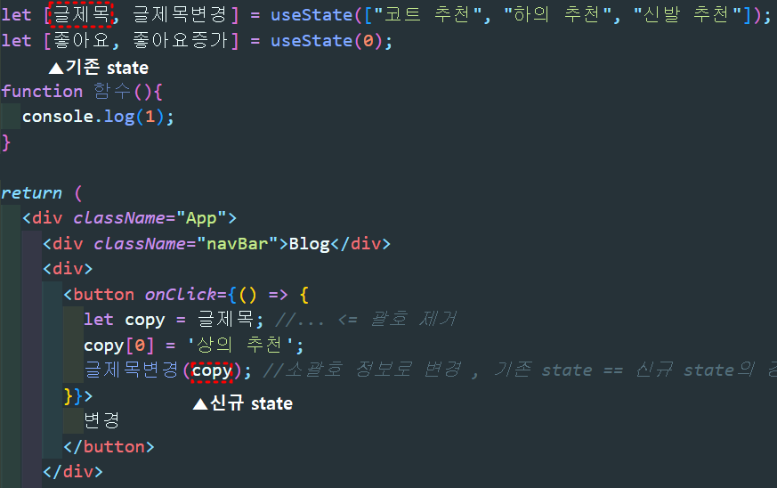
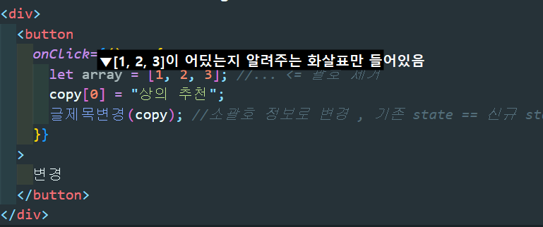
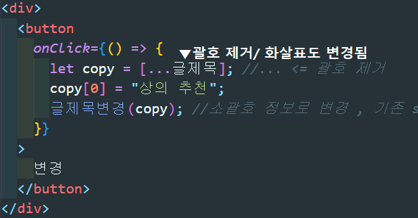
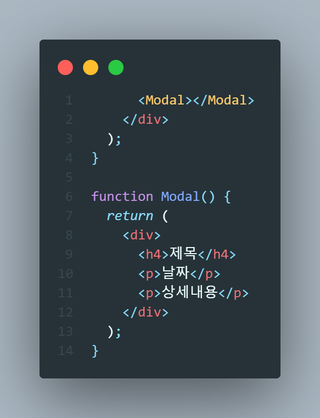

# React 

#### 버튼 변경 동작 원리를 알아보자.

```react
<button onClick={() => {
  let copy = [...글제목]; //... <= 괄호 제거
  copy[0] = '상의 추천';
  글제목변경(copy); //소괄호 정보로 변경 , 기존 state == 신규 state의 경우 변경 안됨.
 }}>
  변경
</button>
```

✔ __state 변경 함수 동작원리__



- 기존 state == 신규 state가 동일하면 변경이 되지 않는다.


✔ __array/object 특징__

- array/object 담은 변수엔 화살표만 저장된다.



- ' ... ' 추가로 괄호를 제거하고 '[]'로 괄호 다시 씌워주면서 화살표가 변경된다.




### Component 사용하기



1. function 만들기 (기존 코드 외부)
2. return()안에 html 담기
3. <함수명></함수명>


__✔장점__

- 반복적인 html 축약할 때

- 큰 페이지들

- 자주변경되는 것들

__✔단점__

- state 사용시 문제 발생 

  => A함수에 있던 변수는 B함수에서 맘대로 쓸 수 없다.)